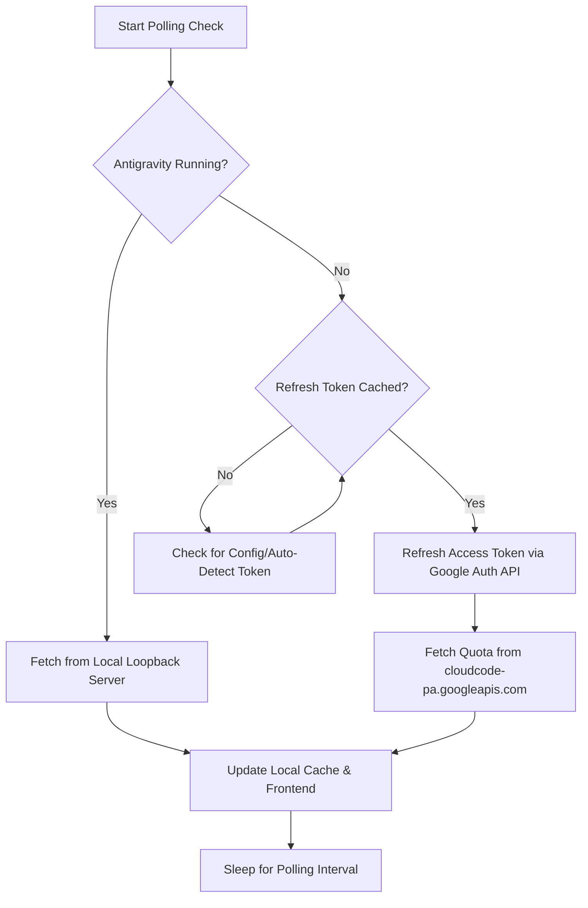

# Antigravity Quota Widget Design Document

## 1. Goal & Overview
The Antigravity Quota Widget is a lightweight Windows-only desktop widget that displays the current remaining quota and usage percentage of the Antigravity developer assistant. It integrates deeply with the Windows Desktop layer (Wallpaper Engine-style) by reparenting itself to the Windows `WorkerW` window, remaining transparent, click-through, and fixed to a specific screen corner.

## 2. Architecture & Tech Stack
- **Framework**: Tauri v2 (Rust Backend + Svelte 5 Frontend)
- **Frontend Styling**: Tailwind CSS (Dark Navy & Gold theme)
- **Windows Integration**: Windows APIs via the `windows` crate (for `WorkerW` reparenting, transparency, click-through, and registry-based Autostart)
- **State & Communication**: Tauri IPC (Commands & Events)
- **Background Engine**: Tokio async task running a polling loop

## 3. Detailed Component Design

### 3.1. Windows OS Layer (WorkerW Reparenting)
To achieve the Wallpaper Engine-like behavior where the widget stays behind all other windows and desktop icons:
1. During initialization, the Rust backend retrieves the HWND (Window Handle) of the Tauri webview window.
2. It sends message `0x052C` to the `Progman` window, forcing Windows to spawn a `WorkerW` window.
3. It enumerates top-level windows to locate the spawned `WorkerW` window that is positioned behind the desktop icons (`SHELLDLL_DefView`).
4. It calls `SetParent(tauri_hwnd, workerw_hwnd)` to reparent the widget.
5. It applies Window styles `WS_EX_TRANSPARENT` and `WS_EX_LAYERED` using `SetWindowLongPtrW` to ensure click-through capability and proper alpha blending.

### 3.2. Quota Retrieval Engine (Data Flow)
The backend polls for quota updates according to a prioritized fallback chain:



- **Priority 1**: Connect to the local loopback server hosted by the main Antigravity application. If active, query it for current usage.
- **Priority 2**: If Antigravity is closed, fetch the cached Google Cloud OAuth `refresh_token` from the configuration directory, request a new `access_token` from Google OAuth endpoints, and fetch the quota directly from `cloudcode-pa.googleapis.com`.
- **Auto-Detection**: On startup, the widget attempts to auto-detect the `refresh_token` by scanning standard configuration paths for Antigravity (e.g., `%USERPROFILE%/.antigravity/` or VS Code's global storage). If not found, it falls back to a manually entered token in the widget's `config.json`.
- **Local Cache**: Every successful fetch writes the quota data to `cache.json`. If all network checks fail, the cached data is loaded, and the UI is updated to a desaturated state with an exclamation warning.

### 3.3. Polling Intervals & Dynamics
- **Normal Interval**: 3 to 5 minutes (default: 5 minutes).
- **Heavy Usage (Temporary Speed-up)**: Polling interval increases to 30-60 seconds for 5 minutes when:
  - The user triggers a manual refresh via the System Tray.
  - The local loopback connection to Antigravity is active (signifying active development work).
- **Reset-Time Interval**: Within 15 minutes of the daily reset time (00:00 UTC / 07:00 AM ICT), the polling frequency increases to every 30 seconds to catch the quota reset immediately.

### 3.4. System Tray & Autostart
A persistent System Tray icon provides the following controls:
- **Refresh Now**: Forces an immediate quota update and triggers the heavy usage polling state.
- **Run at Startup**: Toggles a Windows Registry key under `Software\Microsoft\Windows\CurrentVersion\Run`. Enabled by default on first launch.
- **Exit**: Safely closes the widget.

## 4. File Structure & Schema

```
e:\QuotaCheck/
├── src-tauri/
│   ├── src/
│   │   ├── main.rs         # Entry point (passthrough to lib::run)
│   │   ├── lib.rs          # App setup, tray config, command handlers
│   │   ├── windows_layer.rs # Win32 API interactions (WorkerW reparenting, click-through)
│   │   ├── quota_client.rs  # Fetching logic (local loopback, OAuth + Google API)
│   │   └── config.rs       # Read/Write config.json and cache.json
│   ├── capabilities/
│   │   └── default.json    # Tauri permissions
│   ├── tauri.conf.json     # Tauri app configuration
│   └── Cargo.toml          # Rust dependencies (windows, reqwest, serde, tokio)
├── src/
│   ├── App.svelte          # Main widget UI (Svelte 5)
│   ├── main.css            # Tailwind & CSS styling
│   └── main.ts             # Frontend entrypoint
└── docs/
    └── superpowers/
        └── specs/
            └── 2026-07-13-quota-widget-design.md  # This design document
```

### 4.1. Config Schema (`config.json`)
```json
{
  "refresh_token_override": "",
  "antigravity_config_path": "",
  "monitor_index": 0,
  "offset_x": 20,
  "offset_y": 20,
  "position_corner": "bottom-right",
  "reset_time_utc": "00:00",
  "autostart": true
}
```

### 4.2. Cache Schema (`cache.json`)
```json
{
  "remaining": 350,
  "total": 500,
  "last_updated": "2026-07-13T15:15:00Z",
  "is_offline": false
}
```

## 5. Verification Plan

### 5.1. Automated Tests
- Unit tests in Rust for parsing the Antigravity configuration directory, validating the config loader, and checking token extraction.
- Unit tests for the quota retrieval client mock responses.

### 5.2. Manual Verification
- Verify window placement and alignment across screen sizes.
- Verify click-through behavior: clicks on the widget must pass through to items underneath.
- Test network-down scenarios: disable internet and verify the UI desaturates and displays the exclamation mark.
- Test Antigravity loopback detection: start/stop a mock loopback server and observe polling speed adjustments.
- Test System Tray controls: verify "Refresh Now", "Run at Startup", and "Exit" perform their corresponding actions.
